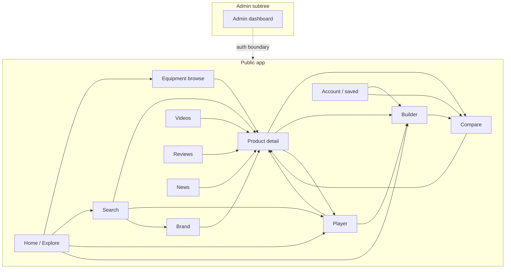

# Navigation & Information Architecture — TTSetupBuilder

> Complete application navigation map and screen-level requirements for every primary and supporting surface.

**Status:** Living document  
**Audience:** Product, UX, design, engineering, AI assistants working on this repo  
**Language:** Requirements-oriented product documentation (English)  
**Constraint:** Documentation only. This file does **not** specify UI components, mockups, visual styling, or implementation code.

**Aligned with:**
- [`docs/PRODUCT_VISION.md`](./PRODUCT_VISION.md) — photography-first equipment database (not ecommerce)
- [`docs/FUNCTIONAL_REQUIREMENTS.md`](./FUNCTIONAL_REQUIREMENTS.md) — personas, stories, FR/NFR (esp. §6 Navigation)
- [`ROADMAP.md`](../ROADMAP.md) — phased delivery (catalog → builder → community)
- Companion when present: `docs/DATA_MODEL.md`

---

## 1. Document purpose

This document defines:

1. **Global navigation chrome** (header, primary nav, footer, persistent patterns)
2. **Every primary screen** with purpose, routes, jobs, layout zones, modules, actions, and states
3. **Supporting screens** required for a coherent information architecture (IA)
4. **Deep-linking / shareable URL** principles
5. **Sitemap overview** and **anti-patterns** that must not appear in navigation or page hierarchy

If a proposed screen or nav item conflicts with [`PRODUCT_VISION.md`](./PRODUCT_VISION.md), the vision wins.

---

## 2. IA principles (navigation-specific)

| Principle | Requirement |
|-----------|-------------|
| **Explore > sell** | Navigation labels and page hierarchy optimize discovery, comparison, and composition — never conversion. |
| **Entity graph first** | Primary destinations are entities: Equipment, Players, Brands, Setups/Builds, Collections, Media (Videos), Reviews, News — not “Shop”, “Deals”, or “Cart”. |
| **One primary job per screen** | Each route has a clear job. Secondary modules support that job; they do not compete with it. |
| **Shareable state** | Filtered browse, search queries, compare sets, builds, and player setups should be URL-addressable where practical. |
| **Photography leads** | Browse and search surfaces remain photo grids; detail screens open on media. Nav chrome stays visually quiet. |
| **Compare is a verb** | Multi-select compare is a persistent, cross-route pattern — not a buried settings page. |
| **Admin is separate** | Editorial/ops tooling lives under a distinct subtree and auth boundary; it must not pollute public chrome. |
| **Honest empty states** | Missing photos, sparse catalogs, and unverified claims are first-class UX states — not silent failures. |

---

## 3. Sitemap overview

### 3.1 Text sitemap

```text
Public app
├── /                              Home (Explore)
├── /search                        Search (dedicated)
├── /equipment                     Category browse hub
│   └── /equipment/[category]      Category grid (blades, rubbers, …)
├── /products/[slug]               Product detail
├── /brands                        Brand index
│   └── /brands/[slug]             Brand hub
├── /players                       Player index
│   └── /players/[slug]            Player profile
├── /setups/[id]                   Player setup detail (optional deep page)
├── /collections                   Collection index
│   └── /collections/[slug]        Collection detail
├── /builder                       Racket builder (new)
│   ├── /builder/[buildId]         Saved / shared build
│   └── /builder/from/[setupId]    Open player setup in builder
├── /compare                       Compare workspace
├── /videos                        Videos index
│   └── /videos/[slug]             Video detail
├── /reviews                       Reviews index
│   └── /reviews/[slug]            Review detail
├── /news                          News index
│   └── /news/[slug]               News article
├── /account                       Account hub (when auth exists)
│   ├── /account/builds            Saved builds
│   ├── /account/favorites         Favorites / shortlist
│   └── /account/compares          Saved compare sets (optional)
├── /404                           Not found
└── /error                         Generic error (optional)

Admin (separate chrome + auth)
└── /admin
    ├── /admin                     Dashboard / queue overview
    ├── /admin/products            Product editorial
    ├── /admin/players             Player / setup editorial
    ├── /admin/media               Media library & quality gates
    ├── /admin/collections         Collection curation
    ├── /admin/content             Reviews / news / videos moderation
    └── /admin/taxonomy            Categories, tags, aliases
```

### 3.2 Mermaid overview



---

## 4. Global navigation chrome

### 4.1 Purpose

Provide calm, always-available orientation across the public app without competing with photography or entity content.

### 4.2 Header (conceptual)

**Primary nav items (public):**

| Label | Destination | Notes |
|-------|-------------|-------|
| Explore / Home | `/` | Brand mark may replace “Home” text; logo returns to Explore. |
| Equipment | `/equipment` | Browse hub / default category. |
| Players | `/players` | Professional equipment stories. |
| Builder | `/builder` | Racket composition. |
| Compare | `/compare` | Workspace; also shows tray count badge when items selected. |
| More | Menu / overflow | Videos, Reviews, News, Collections — keep primary bar from overcrowding. |

**Optional overflow destinations:** `/videos`, `/reviews`, `/news`, `/collections`, `/brands`.

**Global utilities (right side / secondary):**

- **Search** — opens global typeahead; “View all results” goes to `/search` (see §5)
- **Compare tray indicator** — count of selected items; click opens tray or `/compare`
- **Account / Saved** — when auth exists: `/account`; otherwise “Saved locally” entry or soft auth prompt on save actions
- **Language** (later) — does not belong in first-viewport content of entity pages

**Explicitly excluded from public header:**

- Cart, checkout, wishlist-as-commerce, “Buy”, “Deals”, price sort as default nav
- Admin links (unless user has admin role: then a discrete “Admin” entry is acceptable, visually secondary)

### 4.3 Footer (conceptual)

Low-emphasis, utility-oriented:

- About / vision link (or project README for open-source)
- Documentation / contributing (open-source context)
- Taxonomy shortcuts: Equipment categories, Brands, Players
- Content: Videos, Reviews, News
- Legal: image rights / attribution note, privacy (when applicable)
- No promotional banners, affiliate strips, or sale modules

### 4.4 Behavioral requirements

- Header remains **minimal height**; sticky is allowed if it does not obscure hero photography on product pages (prefer hide-on-scroll-down / reveal-on-scroll-up on mobile).
- Active route is indicated calmly (underline or muted emphasis) — not loud pills or badges except compare count.
- Keyboard: `/` or `Ctrl/Cmd+K` focuses global search; `Esc` closes overlays.

---

## 5. Search: global vs dedicated page

### 5.1 Global search (chrome overlay / typeahead)

| Aspect | Requirement |
|--------|-------------|
| **Purpose** | Resolve known-name intent in under ~1s perceived latency without a full page load. |
| **Entry** | Header search control; keyboard shortcut. |
| **Results groups** | Products (photo thumbs), Players, Brands, Collections; optionally Setups / Builds when query matches. |
| **Primary actions** | Open entity; “Add to compare” on product rows; “View all results” → dedicated Search page with query preserved. |
| **Not required** | Full filter sidebar inside the overlay (keep overlay fast and scannable). |

### 5.2 Dedicated Search page (`/search`)

| Aspect | Requirement |
|--------|-------------|
| **Purpose** | Full visual results workspace for queries that need browsing, filters, and pagination/infinite scroll. |
| **When used** | Ambiguous queries, “view all”, empty typeahead handoff, shared search URLs. |
| **Relationship** | Global search is the accelerator; `/search` is the place. Both must share query param conventions. |

See **§8 Search** for full screen documentation.

---

## 6. Compare tray / persistent selection pattern

### 6.1 Purpose

Make “select for comparison” a native cross-app verb (PCPartPicker-like), without forcing users to enter Compare before selecting.

### 6.2 Behavior

| Rule | Requirement |
|------|-------------|
| **Scope** | Primarily **products** (same or mixed categories allowed; mixed-category compare must explain limited attribute alignment). |
| **Capacity** | Soft max (e.g. 4–8 items). When full, prompt to remove or open Compare. |
| **Persistence** | Session-persistent at minimum; URL sync on `/compare`; optional save to account later. |
| **Tray UI** | Compact strip or drawer: photo thumbs, names, remove, “Open compare”, “Clear all”. |
| **Surfaces that can add** | Equipment grids, Search results, Product detail, Brand grids, Collection grids, “Similar” modules. |
| **Surfaces that should not dominate** | Home hero, News articles, Admin. |
| **Badge** | Header Compare item shows selection count. |

### 6.3 Navigation out

- Tray → `/compare?ids=…` (or equivalent slug list)
- From Compare → any PDP; “Open in builder” when selection includes a coherent racket set (blade + rubbers)

### 6.4 Empty / error

- Empty tray: gentle prompt “Add products from Equipment or Search” with links — no sales language.
- Invalid IDs in URL: drop unknowns, show notice, keep valid set.

---

## 7. Deep-linking & shareable URLs

### 7.1 Principles

1. **Entities have stable slugs** (`/products/butterfly-tenergy-05`, `/players/ma-long`).
2. **Exploration state is addressable:** query, filters, sort, page/cursor.
3. **Composition state is addressable:** compare ID lists; builder configurations (full or short ID).
4. **Prefer opaque short IDs for long state** (builds, complex compares) with optional expanded query for debugging.
5. **Share links open the same mental model** on mobile and desktop (layout may differ; content and selection must not).
6. **No silent mutation:** opening a shared compare/build must not overwrite the viewer’s local tray without confirmation (merge / replace prompt).

### 7.2 Suggested query conventions (conceptual)

| Surface | Example |
|---------|---------|
| Search | `/search?q=dignics&type=rubber&brand=butterfly` |
| Category | `/equipment/blades?brand=butterfly&tag=innerfiber&sort=newest-media` |
| Compare | `/compare?ids=slug-a,slug-b,slug-c` |
| Builder | `/builder/[buildId]` or `/builder?blade=…&fh=…&bh=…` |
| Player setup | `/players/[slug]?setup=2024-wtt` or `/setups/[id]` |

### 7.3 SEO / social (requirements-level)

- Public entity pages should support meaningful titles and Open Graph images from **primary photography**.
- Admin routes are `noindex`.
- Draft / unverified content should not be share-indexed as canonical fact.

---

## 8. Screen: Home (Explore)

### 8.1 Purpose

Invite visual wandering. Establish that TTSetupBuilder is a curated equipment museum, not a shop. First viewport: brand + one calm invitation + dominant photography — not a dashboard.

### 8.2 Route / URL pattern

- `/`

### 8.3 Entry points

- Direct visit / brand mark
- External links to site root
- Post-logout / “continue exploring” returns

### 8.4 Primary user jobs

- Discover (Job A)
- Soft entry into Search, Equipment, Players, Builder
- Optional: surface one collection or featured photography set

### 8.5 Layout zones

1. **Hero media plane** — full-bleed or near full-bleed equipment photography (product or curated set); brand/wordmark as hero-level signal; one short supporting line; one CTA group (e.g. Explore equipment / Search / Open builder).
2. **Primary paths strip** — Equipment · Players · Builder · Search (or equivalent calm entry cards that are *paths*, not product cards).
3. **Featured photography / collections** — limited modules (1–2), photo-forward.
4. **Optional “Recently updated photography” or “Notable setups”** — below the fold only; never compete with hero.
5. **Footer**

**Forbidden in first viewport:** stats strips, news digests, review carousels, price modules, affiliate banners, multi-widget dashboards.

### 8.6 Content / modules

- Hero photography (editorial quality)
- Path entries
- 0–2 discovery modules (collection, featured products grid, or “players in focus”)
- Soft link to Videos/News only secondary / below fold if needed for roadmap surfaces

### 8.7 Primary & secondary actions

| Primary | Secondary |
|---------|-----------|
| Explore equipment | Open search |
| | Browse players |
| | Start builder |
| | Open a featured collection |

### 8.8 Navigation out

→ `/equipment`, `/search`, `/players`, `/builder`, `/collections/[slug]`, `/products/[slug]` from featured items

### 8.9 Empty / loading / error

| State | Requirement |
|-------|-------------|
| Loading | Skeleton for hero + path strip; no layout jump that hides brand |
| Empty catalog | Honest “Catalog coming online” with Search disabled or limited; do not fake products |
| Error | Retry for featured modules; hero may fall back to static brand photography |

### 8.10 Mobile vs desktop

- Mobile: single-column; hero remains dominant; path entries stack; avoid horizontal widget overload.
- Desktop: hero can use wider photography; path entries in one row; still one composition, not a control panel.

### 8.11 Photography / visual-exploration notes

Home is the taste contract. Photography must lead. Motion (if any) orients (subtle pan / fade of hero set), never autoplay video over stills.

---

## 9. Screen: Search

### 9.1 Purpose

Resolve intent fast: exact match, aliases, or closest neighborhood — while keeping results visually scannable (Google Photos / Steam density with Apple calm).

### 9.2 Route / URL pattern

- `/search`
- `/search?q={query}&…filters`

### 9.3 Entry points

- Global typeahead “View all”
- Header search submit
- Empty-state suggestions from other pages
- Shared search URLs
- Home CTA

### 9.4 Primary user jobs

- Search (Job B)
- Discover via filters / related suggestions
- Add to compare from results
- Jump to players/brands when query matches entities

### 9.5 Layout zones

1. **Query bar** — prominent; shows active query and clear control.
2. **Entity-type tabs or facets** — All · Products · Players · Brands · Collections (optional).
3. **Filter rail** (desktop) / **filter sheet** (mobile) — category, brand, tags, era, media-completeness (“has hero photo”), etc.
4. **Results photo grid** — primary; dense but breathable.
5. **Optional insight strip** — “Did you mean…”, alias resolution notice, “similar collections”.

### 9.6 Content / modules

- Result cards: **hero photo first**, name, brand, category; confidence/alias match hint when useful
- Zero-result suggestions: popular explorations, collections, softened spelling suggestions
- Power filters that do not collapse the grid into table rows

### 9.7 Primary & secondary actions

| Primary | Secondary |
|---------|-----------|
| Open result | Add to compare (products) |
| Refine filters | Switch entity tab |
| Clear query | Share search URL |

### 9.8 Navigation out

→ PDP, Player, Brand, Collection; → Compare tray; → Builder (if “use in build” appears on product results — secondary)

### 9.9 Empty / loading / error

| State | Requirement |
|-------|-------------|
| Loading | Grid skeletons with photo aspect reserved |
| Empty | Explain no matches; suggest aliases / browse paths; never “buy alternatives” |
| Error | Retry; preserve query in URL |

### 9.10 Mobile vs desktop

- Mobile: filters in bottom sheet; sticky query bar; grid 2-column default.
- Desktop: sticky filter sidebar; wider grid; keyboard focus remains on query for power users.

### 9.11 Photography / visual-exploration notes

Results must remain a **photo grid**. List/table toggle is optional later; default is visual. Missing images show explicit “Photo pending” debt state — not broken icons.

---

## 10. Screen: Product (product detail / PDP)

### 10.1 Purpose

Make the user **understand the object** through inspection-grade photography, then relationships (similar, used-by, setups). Learning text supports the eye.

### 10.2 Route / URL pattern

- `/products/[slug]`
- Optional: `/products/[slug]?variant={sponge|color|…}` for nested variants (not separate catalog spam)

### 10.3 Entry points

- Equipment grids, Search, Brand, Collection, Compare, Player setups, Builder part slots, Videos/Reviews/News deep links, Similar modules

### 10.4 Primary user jobs

- Learn (Job F)
- Find similar (Job G)
- Compare (add)
- Bridge to players and builder
- Inspect media (angles, macro)

### 10.5 Layout zones

1. **Media gallery (dominant)** — hero + angle set + detail/macro; lightbox / immersive viewer.
2. **Identity zone** — canonical name, brand link, category/taxonomy, aliases (collapsible).
3. **Structured attributes** — ratings when sourced, materials, ply, hardness, etc.; **Unknown/Unverified** allowed.
4. **Actions cluster** — Add to compare; Use in builder; Favorite/save (when available). **No primary purchase CTA.**
5. **Used by professionals** — player + setup chips with gear photos.
6. **Appears in setups / builds**
7. **Similar equipment**
8. **Learning notes / lore** (sourced)
9. **Low-emphasis references** — manufacturer page, community discussion (never page purpose)

### 10.6 Content / modules

- Media asset set with shot-type labels (hero, detail, edge, etc.)
- Provenance labels on attributes and setup claims
- Variant selector nested under product (sponge thickness, color) without exploding navigation
- Related videos / reviews snippets (secondary; link out to full screens)

### 10.7 Primary & secondary actions

| Primary | Secondary |
|---------|-----------|
| Inspect media (gallery) | Add to compare |
| | Open similar product |
| | Open player who uses it |
| | Use in builder |
| | Share product URL |
| | External reference links (low emphasis) |

### 10.8 Navigation out

→ Compare, Builder, Player, Brand, Similar PDP, Collection, Video/Review detail

### 10.9 Empty / loading / error

| State | Requirement |
|-------|-------------|
| Loading | Media skeleton first; identity secondary |
| Missing photos | Explicit data-debt panel; do not pretend stock art is editorial |
| Sparse attributes | Show Unknown; do not invent ratings |
| 404 slug | Not-found with search + category browse escape hatches |
| Error | Retry media independently from text if possible |

### 10.10 Mobile vs desktop

- Mobile: gallery full-width on top; sticky secondary action bar (Compare / Builder) acceptable if quiet.
- Desktop: gallery may share horizontal space with identity **only if photography still dominates** (vision: media leads).

### 10.11 Photography / visual-exploration notes

PDP is the photography doctrine’s home. No floating promo badges on images. Video, if present, is opt-in and secondary to still inspection.

---

## 11. Screen: Player (player profile)

### 11.1 Purpose

IMDB-like entity page for a professional’s **equipment story** — setups over time, not tabloid biography.

### 11.2 Route / URL pattern

- `/players/[slug]`
- Optional deep setup: `/players/[slug]/setups/[setupId]` or `/setups/[id]`

### 11.3 Entry points

- Players index, Search, PDP “Used by”, Brand co-occurrence, News/Videos credits, Home featured

### 11.4 Primary user jobs

- Explore professionals (Job E)
- Jump into products and builder (“Open this setup in builder”)
- Discover related equipment neighborhoods via co-occurrence

### 11.5 Layout zones

1. **Identity header** — name, optional nation/club context (light), era tags; photography of player is **secondary to gear storytelling**.
2. **Current / notable setup** — visual assembly of blade + FH + BH (+ extras) with product photos.
3. **Setup timeline** — dated changes when known; confidence labels (confirmed / rumored).
4. **Equipment credits list** — all linked products.
5. **Related players** (careful discovery: same equipment cluster / teammates — avoid gossip framing).
6. **Media** — match photos only when they serve equipment clarity.

### 11.6 Content / modules

- Setup cards as first-class objects
- Provenance on each claim
- “Open in builder” bridge
- Links into Compare for two products from a setup (optional)

### 11.7 Primary & secondary actions

| Primary | Secondary |
|---------|-----------|
| Open setup products | Open setup in builder |
| Explore timeline | Share player URL |
| | Related player |

### 11.8 Navigation out

→ PDP, Builder (`/builder/from/[setupId]`), Brand, Compare, Videos mentioning player

### 11.9 Empty / loading / error

| State | Requirement |
|-------|-------------|
| No setups yet | Honest empty: “Equipment history not documented”; invite browse products — not fake lists |
| Unverified only | Banner explaining confidence |
| 404 | Player not found + search players |

### 11.10 Mobile vs desktop

- Mobile: setup as vertical stack of product photos; timeline as vertical scroller.
- Desktop: setup can present as a composed racket visualization + side timeline.

### 11.11 Photography / visual-exploration notes

Prioritize **gear photography** pulled from product entities. Player portrait is identity, not the catalog.

---

## 12. Screen: Brand

### 12.1 Purpose

Brand as **discovery hub**, not storefront. Scan a manufacturer’s catalog visually and understand lineup structure.

### 12.2 Route / URL pattern

- `/brands` — index
- `/brands/[slug]` — brand hub

### 12.3 Entry points

- Equipment filters, PDP identity, Search, footer, collections (“all Butterfly innerfiber…”)

### 12.4 Primary user jobs

- Discover within a brand family
- Browse by category under brand
- Compare siblings
- Jump to players associated with brand equipment (optional module)

### 12.5 Layout zones

**Index (`/brands`):**
1. Search-within-brands
2. Logo/name grid (visual, calm)
3. Optional A–Z jump links

**Hub (`/brands/[slug]`):**
1. Brand identity (logo, short neutral description — no marketing hype)
2. Category subnav (Blades, Rubbers, …)
3. Photo product grid with filters
4. Optional: featured collections for this brand; notable players using brand gear

### 12.6 Content / modules

- Product grid (photography-first)
- Filters: category, tags, era, media completeness
- “Lineage” notes later (supersedes) — secondary

### 12.7 Primary & secondary actions

| Primary | Secondary |
|---------|-----------|
| Open product | Add to compare |
| Filter category | Open related collection |
| | Share brand URL |

### 12.8 Navigation out

→ PDP, Collection, Player, Search scoped to brand

### 12.9 Empty / loading / error

| State | Requirement |
|-------|-------------|
| Brand with no products | Empty catalog state + link to Equipment |
| Loading | Grid skeletons |
| 404 | Brand not found |

### 12.10 Mobile vs desktop

- Same as category browse: filter sheet vs sidebar; grid density adapts.

### 12.11 Photography / visual-exploration notes

Brand pages must not look like shop category landing pages with promos. No “shop all” or sale framing.

---

## 13. Screen: Builder (racket builder)

### 13.1 Purpose

Compose a racket as a **system** you can see and share (PCPartPicker mental model + Apple-level product respect). Not a checkout configurator.

### 13.2 Route / URL pattern

- `/builder` — new empty / default build
- `/builder/[buildId]` — saved or shared build
- `/builder/from/[setupId]` — hydrate from player setup
- Optional query hydration: `?blade=&fh=&bh=`

### 13.3 Entry points

- Primary nav, Home CTA, PDP “Use in builder”, Player “Open setup in builder”, Account saved builds, Compare “assemble selection”

### 13.4 Primary user jobs

- Build (Job D)
- Compare candidate parts (handoff to Compare)
- Save / share / duplicate
- Learn compatibility conventions (guidance, not punitive walls)

### 13.5 Layout zones

1. **Visual assembly canvas** — composed racket preview (blade + FH + BH); central, calm.
2. **Slot list** — Blade · Forehand rubber · Backhand rubber · optional extras (edge tape, etc.).
3. **Part picker** — search + photo grid filtered by slot category; recently used / similar.
4. **Build summary** — aggregated specs, notes, unknowns.
5. **Guidance panel** — compatibility assumptions documented; warnings are informative.
6. **Actions bar** — Save, Share, Duplicate, Clear slot, Open compare for two candidates.

### 13.6 Content / modules

- Slot emptiness as first-class (“Choose a blade”) with visual placeholder — not error-red panic
- Compatibility notes and convention docs
- Link back to source player setup when applicable
- Export: share URL; optional image summary later

### 13.7 Primary & secondary actions

| Primary | Secondary |
|---------|-----------|
| Assign part to slot | Save build |
| Inspect part (open PDP in context / side peek) | Share link |
| | Duplicate |
| | Compare two candidates |
| | Reset build |

### 13.8 Navigation out

→ PDP (part detail), Compare, Player setup source, Account builds, Equipment browse for slot

### 13.9 Empty / loading / error

| State | Requirement |
|-------|-------------|
| Empty build | Inviting canvas + slot prompts |
| Invalid shared build | Explain missing products; allow partial load |
| Compatibility conflict | Non-blocking warning with “why” |
| Save without auth | Local save + soft account prompt (when auth timing allows) |
| Loading parts | Picker skeletons |

### 13.10 Mobile vs desktop

- Mobile: canvas on top; slots as stepper or accordion; picker as full-screen sheet.
- Desktop: canvas + slots side-by-side; picker panel; keyboard-friendly slot navigation.

### 13.11 Photography / visual-exploration notes

Assembly visualization and part-picker grids are photography-led. Avoid ecommerce “configure and buy” step indicators.

---

## 14. Screen: Compare

### 14.1 Purpose

Decide between N items with **aligned eyes and attributes**. Photography slots synchronize before tables dominate.

### 14.2 Route / URL pattern

- `/compare`
- `/compare?ids={id-list}`
- Optional: `/compare?ids=…&baseline={id}`

### 14.3 Entry points

- Compare tray / header badge
- “Add to compare” from grids/PDP
- Shared compare URLs
- Builder candidate compare
- Account saved compares (optional)

### 14.4 Primary user jobs

- Compare (Job C)
- Find similar from a pinned baseline
- Hand off coherent sets to Builder
- Share shortlist

### 14.5 Layout zones

1. **Photo row / synchronized slots** — equal framing; baseline pin indicator.
2. **Identity row** — name, brand, category.
3. **Attribute matrix** — differences highlighted; unknowns explicit.
4. **Column controls** — remove, reorder, pin baseline, add another (opens search/picker).
5. **Footer actions** — Share, Clear, Open in builder (when applicable), Continue browsing.

### 14.6 Content / modules

- Mixed-category notice when attributes cannot align fairly
- “Why different” highlights (structured diffs)
- Similar-to-baseline suggestions (optional module below matrix)

### 14.7 Primary & secondary actions

| Primary | Secondary |
|---------|-----------|
| Inspect aligned photos | Pin baseline |
| Scan attribute diffs | Remove column |
| | Add product |
| | Share compare URL |
| | Open PDP |
| | Open in builder |

### 14.8 Navigation out

→ PDP, Search/picker, Builder, Equipment browse to add more

### 14.9 Empty / loading / error

| State | Requirement |
|-------|-------------|
| Zero items | Empty workspace with paths to Equipment / Search |
| One item | Allow park state; prompt to add second |
| Loading | Slot skeletons keeping alignment |
| Invalid IDs | Drop + toast/notice |
| Merge conflict with local tray | Ask Replace vs Merge on shared link open |

### 14.10 Mobile vs desktop

- Mobile: horizontal swipe between product columns **or** stacked sections with sticky product switcher; photo alignment still attempted.
- Desktop: multi-column matrix; sticky photo row while scrolling attributes.

### 14.11 Photography / visual-exploration notes

Prefer comparison-plate style consistency. Do not cover photos with ribbons or score badges.

---

## 15. Screen: Videos

### 15.1 Purpose

Media-forward discovery of equipment-related video (reviews, unboxings, match gear close-ups) that **deep-links into product and player entities**. Video supports the database; it does not replace still photography as catalog inventory.

### 15.2 Route / URL pattern

- `/videos`
- `/videos/[slug]`

### 15.3 Entry points

- Header overflow / footer, PDP related media, Player page, News cross-links, Search (when type=video)

### 15.4 Primary user jobs

- Learn / Discover via motion media
- Jump to featured products / players credited in the video
- Optional: add featured products to compare

### 15.5 Layout zones

**Index:**
1. Filters / topics (equipment category, brand, player)
2. Video grid — thumbnail + title + linked entities chips
3. Sort: newest, relevance (not “trending sales”)

**Detail:**
1. Player (opt-in play; no autoplay-steal on entry from catalog)
2. Title / provenance / source attribution
3. **Tagged products** photo strip
4. Tagged players
5. Transcript / chapters later (optional)
6. Related videos

### 15.6 Content / modules

- Rights/source metadata
- Entity graph links (mandatory for value)
- Explicit “stills preferred for inspection” when linking to PDP gallery

### 15.7 Primary & secondary actions

| Primary | Secondary |
|---------|-----------|
| Play (user-initiated) | Open tagged product |
| | Open player |
| | Add product to compare |
| | Share video URL |

### 15.8 Navigation out

→ PDP, Player, Brand, related Video, Reviews (if companion written review)

### 15.9 Empty / loading / error

| State | Requirement |
|-------|-------------|
| Empty library | Phase-aware empty (“Videos arrive with community / media phase”) + browse equipment |
| Playback error | Fallback link to source if external; keep entity strip usable |
| Untagged video | Encourage editorial tagging in admin; public page still lists title |

### 15.10 Mobile vs desktop

- Mobile: vertical video feed optional later; default grid + detail.
- Desktop: player with side entity rail preferred.

### 15.11 Photography / visual-exploration notes

Thumbnails should not be mistaken for product hero inventory. PDP stills remain canonical for inspection.

---

## 16. Screen: Reviews

### 16.1 Purpose

Long-form or structured community/editorial reviews that **illuminate equipment**, with clear separation of opinion vs measured attributes. Not a star-rating marketplace widget farm.

### 16.2 Route / URL pattern

- `/reviews`
- `/reviews/[slug]`
- Optional filter: `/reviews?product=[slug]`

### 16.3 Entry points

- Overflow nav, PDP “Reviews” module, Search, Player/Brand contextual lists (phase 6 community)

### 16.4 Primary user jobs

- Learn (Job F) via experienced voices
- Cross-check multiple products mentioned
- Navigate to PDP / Compare

### 16.5 Layout zones

**Index:**
1. Filters: product category, brand, rating confidence, editorial vs community
2. Review cards: title, author, **product photo thumbnails** of subjects, excerpt
3. Avoid score-only list rows without imagery

**Detail:**
1. Title / author / date / provenance
2. Subject products strip (photography)
3. Body content
4. Attribute callouts labeled as opinion vs manufacturer data
5. Comments later (community phase) — moderated

### 16.6 Content / modules

- Confidence and conflict notices (“Author spin feel ≠ manufacturer rating”)
- Links to Compare subjects
- Related reviews

### 16.7 Primary & secondary actions

| Primary | Secondary |
|---------|-----------|
| Read review | Open product |
| | Add subjects to compare |
| | Share review |

### 16.8 Navigation out

→ PDP, Compare, Author (if user profiles exist later), Videos companion

### 16.9 Empty / loading / error

| State | Requirement |
|-------|-------------|
| No reviews for product | PDP module empty with “No reviews yet” — not fake scores |
| Index empty | Phase-aware empty state |
| Removed / unpublished | 404 or gone state |

### 16.10 Mobile vs desktop

- Standard reading column on mobile; wider with sticky product strip on desktop.

### 16.11 Photography / visual-exploration notes

Reviews must pull product heroes into the layout so reading stays anchored in visual identity of gear.

---

## 17. Screen: News

### 17.1 Purpose

Lightweight editorial timeline for equipment releases, rule/era notes, and tournament gear stories — **in service of the database graph**, not a blog that swallows the product.

### 17.2 Route / URL pattern

- `/news`
- `/news/[slug]`

### 17.3 Entry points

- Overflow nav / footer, Home below-fold (optional, never first viewport), entity “In the news” modules

### 17.4 Primary user jobs

- Learn about new gear / eras
- Jump into new product entities and player setups mentioned
- Discover collections spawned from news themes

### 17.5 Layout zones

**Index:**
1. Chronological list or photo-led cards
2. Filters: products, players, tags (release, tournament, era)

**Article:**
1. Title / date / byline
2. Optional hero image (equipment preferred over stock collage)
3. Body
4. **Mentioned entities** module (products, players, brands) — required when mentions exist
5. Related news

### 17.6 Content / modules

- Entity deep links
- Clear labeling of rumors vs confirmed releases
- No affiliate CTA blocks

### 17.7 Primary & secondary actions

| Primary | Secondary |
|---------|-----------|
| Read article | Open mentioned product / player |
| | Share article |
| | Open related collection |

### 17.8 Navigation out

→ PDP, Player, Brand, Collection, Videos

### 17.9 Empty / loading / error

| State | Requirement |
|-------|-------------|
| Empty | Phase-aware; point to Equipment / Players |
| Broken entity mention | Show text without dead-end; hide bad link |

### 17.10 Mobile vs desktop

- Readable single column; entity module stacks under article on mobile, side rail on desktop optional.

### 17.11 Photography / visual-exploration notes

Prefer linking to canonical product photos over embedding low-quality press composites when catalog photos exist.

---

## 18. Screen: Admin

### 18.1 Purpose

Editorial and operations workspace to maintain catalog quality: products, players/setups, media gates, collections, taxonomy, and content moderation. **Separate application chrome** from the public museum experience.

### 18.2 Route / URL pattern

- `/admin` and subtree (see §3.1)
- Auth-gated; `noindex`

### 18.3 Entry points

- Direct URL after login
- Discrete “Admin” control for authorized users (not in public marketing chrome for anonymous users)
- Email deep links to moderation queues (optional)

### 18.4 Primary user jobs

- Create/edit canonical entities
- Enforce photography quality bar (approve / reject / flag debt)
- Maintain aliases, taxonomy, provenance
- Moderate reviews/news/videos
- Resolve duplicate products / merge candidates

### 18.5 Layout zones (admin shell)

1. **Admin sidebar nav** — Products, Players, Media, Collections, Content, Taxonomy, Dashboard
2. **Queue / list main** — tables allowed here (ops efficiency); still show photo thumbs for products
3. **Editor pane** — form + media manager + relationship editors
4. **Quality indicators** — missing hero, low-res, rights unknown, unverified setups

### 18.6 Content / modules

- Dashboard: counts of photo debt, unverified setups, pending community submissions
- Media library with shot-type tagging
- Diff / revision history (later)
- Audit log for sensitive merges

### 18.7 Primary & secondary actions

| Primary | Secondary |
|---------|-----------|
| Publish / save entity | Preview public page |
| Approve media | Reject with reason |
| | Merge duplicates |
| | Open public URL |

### 18.8 Navigation out

- Preview → public PDP/Player (new tab)
- Logout → public Home
- Cross-links within admin only for ops tasks

### 18.9 Empty / loading / error

| State | Requirement |
|-------|-------------|
| Unauthorized | Hard gate; no public nav leakage of drafts |
| Empty queues | “All clear” states |
| Save conflict | Explicit conflict resolution |
| Media upload failure | Retry + keep metadata draft |

### 18.10 Mobile vs desktop

- Admin is **desktop-first**. Mobile may support light moderation queues but full editors are desktop-oriented.
- Do not attempt to reuse public Explore chrome inside Admin.

### 18.11 Photography / visual-exploration notes

Admin must make **missing or weak photography impossible to ignore** (queues, badges on rows). Public taste starts with admin gates.

### 18.12 Admin navigation subtree (summary)

| Nav item | Job |
|----------|-----|
| Dashboard | Queues & health |
| Products | CRUD, variants, aliases, relationships |
| Players | Profiles, setups, confidence |
| Media | Library, rights, shot types, quality |
| Collections | Editorial groupings |
| Content | Reviews, news, videos moderation |
| Taxonomy | Categories, tags, eras |

---

## 19. Supporting screens

These are required for a coherent IA. Documented at requirements level (same structure, slightly condensed).

---

### 19.1 Equipment browse hub & category

**Purpose:** Scan thousands of products without fatigue (Steam library energy + Apple spacing).  
**Routes:** `/equipment`, `/equipment/[category]`  
**Entry:** Nav, Home, Brand filters, Search facet, footer  
**Jobs:** Discover, filter, multi-select compare  
**Layout zones:** Sticky lightweight filters; dense photo grid; sort (relevance, newest photography, view popularity — **not** best-selling); optional collection promos as editorial not commercial  
**Actions:** Open PDP, add to compare, save favorite  
**Out:** PDP, Compare, Brand, Collection  
**States:** Empty category; loading skeletons; filter-no-results with clear filters  
**Mobile/desktop:** Filter sheet vs sidebar  
**Photography:** Grids are photo grids; missing photo = visible debt

---

### 19.2 Players index

**Purpose:** Find professionals to explore equipment stories.  
**Routes:** `/players`  
**Layout:** Search + optional filters (handedness, association — light); visual cards (player identity + current setup gear thumbs)  
**Out:** Player profile  
**Empty:** Phase-aware when player DB thin

---

### 19.3 Collections index & detail

**Purpose:** Human-meaningful slices of the catalog (Steam collections / editorial lists).  
**Routes:** `/collections`, `/collections/[slug]`  
**Layout:** Photo-led collection hero (calm); product grid; descriptive purpose sentence; curatorial note  
**Actions:** Open products, add multiple to compare, share collection URL  
**Out:** PDP, Brand, Search  
**Anti-pattern:** “Shop this collection”

---

### 19.4 Setup detail (player setup)

**Purpose:** First-class setup object when deep-linking or sharing a dated configuration.  
**Routes:** `/setups/[id]` (and/or nested under player)  
**Layout:** Composed gear photography; date/event context; confidence; product list; Open in builder  
**Out:** Player, PDP, Builder, Compare

---

### 19.5 Account / saved builds

**Purpose:** Continuity across sessions — saved builds, favorites, optional saved compares.  
**Routes:** `/account`, `/account/builds`, `/account/favorites`, `/account/compares`  
**Entry:** Save actions, header account  
**Layout:** Lists with photo thumbs; privacy defaults (builds private until shared)  
**Out:** Builder, PDP, Compare  
**Auth:** Soft gate timing per vision open questions; local-first acceptable early  
**Anti-pattern:** Account pages that look like order history / commerce profiles

---

### 19.6 Similar equipment (pattern / optional route)

**Purpose:** Neighborhood exploration (Job G).  
**Routes:** Primarily module on PDP; optional `/products/[slug]/similar`  
**Layout:** Photo grid with “why similar” captions when possible  
**Out:** PDP, Compare

---

### 19.7 Not found (404)

**Purpose:** Recover exploration momentum.  
**Route:** `/404` or framework not-found  
**Content:** Calm message; Search; Equipment; Home — never “recommended deals”

---

### 19.8 Generic error

**Purpose:** Recover from server/client failures without dead ends.  
**Content:** Retry; Home; status honesty  
**Admin errors** stay in admin shell.

---

### 19.9 Empty states as screen types (pattern)

Treat as reusable requirements across public surfaces:

| Empty type | Behavior |
|------------|----------|
| **No results** | Explain + suggest browse paths / alias tips |
| **Photo debt** | Explicit pending photography |
| **Unverified data** | Label, don’t hide |
| **Phase-gated feature** | “Arrives in phase N” with link to working surfaces |
| **Auth-required save** | Soft prompt; don’t block browsing |

---

## 20. Cross-screen selection & state matrix

| State | Survives navigation? | URL? | Notes |
|-------|----------------------|------|-------|
| Compare tray | Yes (session+) | On `/compare` | Merge prompt on shared open |
| Search query | Yes within search | Yes | Global typeahead seeds `/search` |
| Builder draft | Yes | Prefer buildId | Autosave draft optional |
| Filters on browse | Yes within browse | Yes | Shareable explorations |
| Favorites | Account/local | Optional lists | Not commerce wishlist framing |
| Admin draft | Admin only | Admin URLs | Never leak to public chrome |

---

## 21. Anti-patterns (navigation & IA)

Do **not**:

1. Put **Buy / Cart / Checkout / Deals** in global nav or as PDP primary actions.
2. Turn Home into a **dashboard** of stats, news, reviews, and promos in the first viewport.
3. Use **price** as the default sort or a primary filter label.
4. Hide Compare behind obscure menus — it is a pillar.
5. Mix **Admin** IA into public Explore chrome (tables, publish buttons, raw IDs).
6. Treat Builder as a **multi-step checkout wizard**.
7. Let Videos autoplay over catalog photography introspection.
8. Use review **star walls** without product imagery.
9. Create parallel “Shop by brand” storefront language on Brand pages.
10. Break shareable URLs by keeping compare/build state only in non-serializable memory.
11. Overlay **promo badges, sale ribbons, or dense metadata chrome** on hero photography.
12. Optimize nav labels for affiliate click-through.

---

## 22. Phase alignment (roadmap)

| Phase | Navigation implications |
|-------|-------------------------|
| **1** | Document IA (this file); define chrome & routes conceptually |
| **2** | Ship Home, Equipment browse, Search, PDP, Player, Brand; Compare tray basics |
| **3** | Elevate Builder in primary nav; setup→builder bridges |
| **4** | Admin media queues intensify; photo debt states become operationally critical |
| **5** | AI assistant as **assistive overlay / panel** — must not replace Search or become homepage chatbot |
| **6** | Reviews, community contributions, richer Account; Videos/News may thicken — still secondary to catalog |

Features ahead of their phase may appear in nav as **disabled/coming** only if they do not clutter primary chrome; prefer overflow until ready.

---

## 23. Accessibility & inclusive navigation (requirements)

- All nav items keyboard reachable; focus order logical.
- Search shortcut documented in UI affordance.
- Compare tray operable with keyboard; counts announced to assistive tech.
- Visual-first ≠ vision-only: alt text from media metadata; captions on galleries.
- Do not rely on color alone for compare selection state.

---

## 24. Document control

| Field | Value |
|-------|--------|
| Title | Navigation & Information Architecture — TTSetupBuilder |
| Location | `docs/NAVIGATION.md` |
| Companions | `docs/PRODUCT_VISION.md`, `docs/FUNCTIONAL_REQUIREMENTS.md`, `ROADMAP.md`; data model when present |
| Change policy | Update when routes, primary nav, or screen jobs change; note significant shifts in `CHANGELOG.md` |

---

**Bottom line:** Public navigation is a calm map of an equipment **museum-graph** (Explore, Equipment, Players, Builder, Compare + overflow knowledge surfaces). Admin is a separate ops tree. Compare and Search are systemic patterns, not afterthoughts. Every screen earns its place by helping users **see, understand, relate, and compose** gear — never by selling it.
