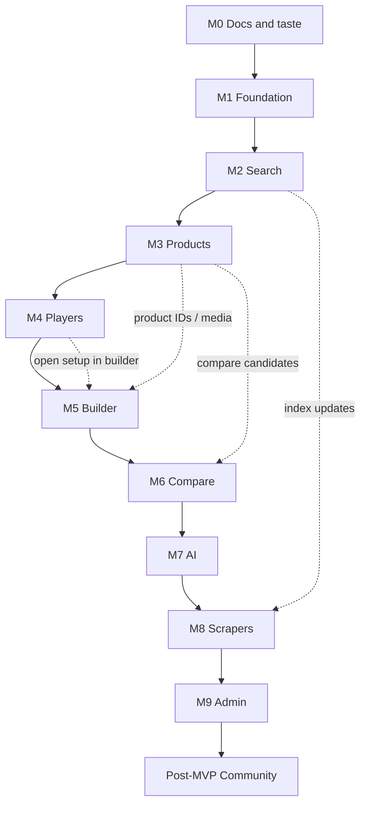
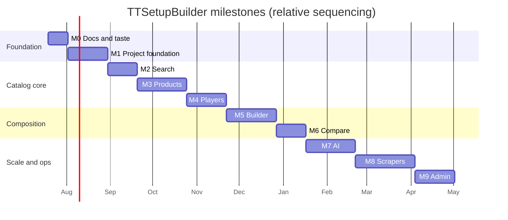

# Development Roadmap — TTSetupBuilder

> Milestone-based delivery plan. Each milestone is independently deployable.

**Status:** Living document  
**Audience:** Engineering, product, design, AI assistants  
**Product constraint:** Photography-first equipment database — **not** ecommerce  
**Companions:** [`ROADMAP.md`](../../ROADMAP.md) · [`PRODUCT_VISION.md`](../PRODUCT_VISION.md) · [`FUNCTIONAL_REQUIREMENTS.md`](../FUNCTIONAL_REQUIREMENTS.md) · [`DATA_MODEL.md`](../DATA_MODEL.md) · [`NAVIGATION.md`](../NAVIGATION.md) · [`docs/ui/DESIGN_SYSTEM.md`](../ui/DESIGN_SYSTEM.md)

---

## 0. How to read this document

| Convention | Meaning |
|------------|---------|
| **Independently deployable** | After the milestone ships, production users can complete a named job via real URLs — without waiting for later milestones |
| **Out of scope** | Explicitly deferred; do not sneak into PRs “while we’re here” |
| **Complexity** | T-shirt (S / M / L / XL) + **engineer-weeks** for **1–2 full-time engineers** (see assumptions below) |
| **Photography gate** | Hard quality bar; failing it blocks “done” even if features work |

### Complexity assumptions

- Team: 1–2 engineers familiar with Next.js / TypeScript; design input available async
- Stack intent (from repo): Next.js, React, TypeScript, Tailwind, Framer Motion, Zustand, TanStack Query
- Monorepo: `apps/web`, `packages/*`, `scrapers/`, `prompts/`
- No ecommerce, payments, or affiliate optimization in any milestone
- Estimates include docs/ADRs needed to ship that milestone, not the entire backlog
- Ranges absorb uncertainty; prefer the high end if photography pipeline or search infra is greenfield for the team

### Deployability principle (summary)

Ship vertical slices: **real URLs + real (even small) data + photography-honest empty states**. Prefer a thin catalog users can explore over a wide feature set that only works in staging. Later milestones add verbs (build, compare, ask AI, ingest at scale, administer) without rewriting earlier surfaces.

---

## 1. Product principles that bind every milestone

Aligned with [`docs/PRODUCT_VISION.md`](../PRODUCT_VISION.md):

1. **Photography leads** — grids are photo grids; PDPs open on media; missing photos are visible data debt
2. **Not a shop** — no cart, checkout, or primary “Buy now”
3. **Honesty over completeness** — “Unknown” / “Unverified” beats invented ratings
4. **Shareable state** — filters, builds, compares → URL-addressable where practical
5. **Catalog scale** — design for thousands of products, hundreds of players — not demo scale only
6. **Pillars** — Photography · Speed · Comparison · Search · Discoverability

### Photography / quality gates (cross-cutting)

| Gate | Applies from | Rule |
|------|----------------|------|
| **G0 — Media contract** | M1 | Image pipeline (variants, CDN or equivalent, alt text, rights fields) defined before bulk upload |
| **G1 — Hero required** | M3 | Core catalog items in production must have a hero packshot or an explicit “photo missing” debt badge — never silent broken thumbs |
| **G2 — Angle set for featured** | M3+ | Curated / featured products target front + detail (or documented exception) |
| **G3 — Compare lighting honesty** | M6 | Compare UI never implies studio-matched plates unless assets are tagged as comparison-ready |
| **G4 — Scraper media quarantine** | M8 | Scraped images land in quarantine until rights + quality review; cannot become primary hero without approval |
| **G5 — AI never invents photos** | M7 | AI may suggest similar items; it must not fabricate product imagery or unverified attributes as fact |

---

## 2. Mapping to root `ROADMAP.md` phases

| Root phase ([`ROADMAP.md`](../../ROADMAP.md)) | Intent | This document |
|-----------------------------------------------|--------|---------------|
| **Phase 1** — Repository, Documentation, Architecture, UI Design | Taste and constraints | **M0** (optional) + **M1** foundation |
| **Phase 2** — Product Database, Player Database, Search | Catalog becomes real | **M2** Search · **M3** Products · **M4** Players |
| **Phase 3** — Racket Builder | Composition as a verb | **M5** Builder |
| *(extended)* — Comparison as native verb | Vision pillar; not a separate root phase yet | **M6** Compare |
| **Phase 5** — AI Assistant | Grounded recommendations / RAG | **M7** AI |
| **Phase 4** — Scrapers | Scale acquisition with quality gates | **M8** Scrapers |
| *(ops / trust)* — Admin tooling | Not a root phase; required for sustainable ops | **M9** Admin |
| **Phase 6** — Community Features | Reviews, contributions, shared builds | **Post-MVP** (after M9) |

**Reconcile notes:**

- Root Phase 4 (Scrapers) is sequenced *after* AI (M7) so scrapers feed a mature schema, search index, media gates, and optional AI labeling — without contradicting Phase 4’s product intent. Root Phase 5 (AI) ships as M7 before large-scale scrape.
- Comparison (M6) sits between Builder and AI. [`FUNCTIONAL_REQUIREMENTS.md`](../FUNCTIONAL_REQUIREMENTS.md) marks Compare as Must / **P2**; this roadmap **defers the full compare workspace** until after Products + Players + Builder so each milestone stays independently deployable. A minimal “Add to compare” stub may appear earlier, but **ship criteria for M6** are the shareable `/compare` workspace (FR-CMP-*). That is an intentional sequencing choice, not a change to FR Must priority.
- Routes and screen jobs must follow [`NAVIGATION.md`](../NAVIGATION.md) (e.g. PDP = `/products/[slug]`, builder share = `/builder/[buildId]`, open-from-setup = `/builder/from/[setupId]`).
- Schema intent follows [`DATA_MODEL.md`](../DATA_MODEL.md); UI tokens/photography chrome follow [`docs/ui/DESIGN_SYSTEM.md`](../ui/DESIGN_SYSTEM.md).
- Still planned as milestones demand: `docs/architecture/FRONTEND_ARCHITECTURE.md`, additional ADRs under `docs/decisions/`.

---

## 3. Dependency graph

**Gantt-style dependency notes (logical, not calendar dates):**

Durations above are **illustrative relative bars** (≈ calendar days for a 1–2 engineer pace), not commitments. Use engineer-week estimates in each milestone section for planning.

---

## Milestone 0 — Documentation & taste lock (optional)

### Goal

Lock product intent, IA, and visual direction before application bootstrap so M1 does not reinvent constraints.

### Why this order / dependencies

- No code dependencies
- Unblocks M1 architecture and UI package decisions
- Aligns with root **Phase 1**

### In scope

- Keep [`PRODUCT_VISION.md`](../PRODUCT_VISION.md) authoritative
- Treat existing FR / data model / navigation / design system as authoritative; close gaps only
- Frontend architecture outline (`docs/architecture/FRONTEND_ARCHITECTURE.md`)
- First ADRs (monorepo layout, image storage approach, “no ecommerce” boundary)

### Out of scope

- App bootstrap, production deploy of features, scrapers, AI

### Independently deployable definition

- **Docs-only:** GitHub/`docs` are the deliverable; no user-facing URL required
- Optional: static doc site or README-driven browsing — not a product deploy

### Acceptance criteria / DoD

- [ ] Vision anti-goals and photography doctrine cited by architecture/UI docs
- [ ] Open questions from vision either answered in ADRs or explicitly deferred with owners
- [ ] `docs/roadmap/README.md` points here

### Risks

- Over-documenting before a thin vertical slice; mitigate with time-box (≤2 weeks)

### Complexity estimate

| Scale | Engineer-weeks | Notes |
|-------|----------------|-------|
| **S** | **1–2** | Mostly writing/alignment; 1 engineer sufficient |

### Suggested sequencing

1. Functional requirements + navigation  
2. Data model sketch + media contract (G0)  
3. Frontend architecture + UI photography notes  
4. ADRs for stack boundaries  

---

## Milestone 1 — Project foundation

### Goal

A deployable Next.js shell with monorepo packages, CI, shared types, database schema baseline, media contract, and a seed path for a tiny honest catalog — ready for search and product surfaces.

### Why this order / dependencies

- Depends on M0 (or equivalent vision lock)
- Everything else mounts on app + schema + image pipeline
- Maps to root **Phase 1** completion and the start of **Phase 2** infra

### In scope deliverables

**Features / product**

- Deployed app shell: home/explore placeholder consistent with vision (calm entry, not dashboard clutter)
- Health/version route; basic global nav stubs (Equipment, Players, Builder, Search) — destinations may 501/empty until later milestones
- Seed script: small set of brands + products with **real or clearly labeled placeholder** photography meeting G0

**Docs**

- Implement against [`DATA_MODEL.md`](../DATA_MODEL.md) (canonical Product, Brand, Media, aliases — start with published subset)
- `docs/architecture/FRONTEND_ARCHITECTURE.md` (App Router layout, data fetching, state)
- ADR: hosting + DB + object storage
- Traceability: FR-SCOPE-*, FR-NAV-* shell, FR-IMG media contract (G0)

**Infra**

- Monorepo tooling (`apps/web`, `packages/types`, `packages/ui`, `packages/database`, `packages/config`)
- CI: lint, typecheck, test stub, preview deploys
- Image pipeline foundation (upload path or seed import, responsive variants, alt text fields)
- Env/secrets pattern; no secrets in git

### Out of scope

- Full search UX, PDP depth, players, builder, compare, AI, scrapers, admin CMS, auth (unless required for deploy platform only)

### Independently deployable definition

Users can open **`/`** (and optionally **`/about`** or status) on the production URL, see photography-first brand intent, and navigate chrome that does not lie about missing features (honest empty/coming states). Operators can run seed + migrate in the target environment.

### Acceptance criteria / DoD

- [ ] Preview/production deploy succeeds from `main`
- [ ] CI green on PRs
- [ ] Schema migrated; seed loads ≥ N products (team-chosen N, e.g. 12–30) with media records
- [ ] G0 media contract documented and implemented for seed images
- [ ] No ecommerce affordances in shell UI
- [ ] README runbooks: local dev, migrate, seed, deploy

### Risks

- Premature package abstraction; keep packages thin until second consumer exists
- Image CDN cost/complexity; start with one provider and a swappable interface
- Empty nav destinations eroding trust — use explicit empty states

### Complexity estimate

| Scale | Engineer-weeks | Notes |
|-------|----------------|-------|
| **L** | **4–6** | Monorepo + CI + DB + media + first deploy; 2 engineers can parallelize app vs infra |

### Suggested sequencing (workstreams)

| Stream | Work |
|--------|------|
| **A — App shell** | Bootstrap Next.js, layout, nav, home composition |
| **B — Data** | DB package, migrations, seed, types |
| **C — Media** | Storage, variants, alt/rights fields |
| **D — Platform** | CI, preview deploys, env docs |

---

## Milestone 2 — Search

### Goal

Search is a **first-class place**: fast typeahead and results that remain visually scannable, over the seed/early catalog from M1.

### Why this order / dependencies

- Depends on **M1** (entities, media URLs, deploy pipeline)
- Ships before deep PDP (M3) so discoverability and indexing patterns exist early; M3 then deepens documents the index already knows
- Root **Phase 2** (Search portion)

### In scope deliverables

**Features**

- `/search` (and global command/typeahead entry)
- Exact + fuzzy name match; brand + model; alias fields in schema/index
- Results as **photo-forward** list/grid (not title+price rows)
- Basic filters that do not destroy visual browsing (category, brand)
- Empty states with suggested queries / explore links
- Perceived latency target: typeahead feels instant on seed scale; document p95 budget for larger catalogs

**Docs / infra**

- Search approach ADR (Postgres full-text vs dedicated search engine — choose for current scale, note migration path)
- Indexing job or trigger from product writes
- Conform to [`NAVIGATION.md`](../NAVIGATION.md) §5 and FR-SEA-* (typeahead + `/search`)

### Out of scope

- Visual similarity embeddings (M7+)
- Advanced facet UX for all attributes (M3+)
- Player search depth (M4 can extend the same engine)
- “AI answers” replacing results (M7)

### Independently deployable definition

On production, a user can open **`/search`**, type a known seeded name or alias, and land on results with thumbnails; selecting a result opens **`/products/[slug]`** (thin stub acceptable if M3 is not done — stub must show hero + name).

### Acceptance criteria / DoD

- [ ] Alias resolution demoed for at least one well-known colloquial (e.g. H3 ↔ Hurricane 3) in seed data
- [ ] Keyboard-accessible typeahead
- [ ] No broken image silence — missing media uses debt/empty component
- [ ] Search index rebuild documented and runnable in CI or ops runbook
- [ ] Performance budget noted for 1k / 10k product projections

### Risks

- Choosing a heavy search stack too early; prefer boring tech until scale hurts
- Shipping search against stubs that disappoint — mitigate with honest thin PDP or gate public launch until M3 overlaps

### Complexity estimate

| Scale | Engineer-weeks | Notes |
|-------|----------------|-------|
| **M** | **2–4** | Higher if introducing an external search service |

### Suggested sequencing

1. Index schema + write path from products  
2. API / server query + typeahead UI  
3. `/search` results page + filters  
4. Alias fixtures + empty states + perf notes  

---

## Milestone 3 — Products

### Goal

Photography-first **equipment catalog and PDPs** — the core of the museum experience.

### Why this order / dependencies

- Depends on **M1** (schema/media) and **M2** (discovery into products)
- Unlocks Players (credits), Builder (parts), Compare (candidates)
- Root **Phase 2** (Product Database)

### In scope deliverables

**Features**

- `/equipment` and `/equipment/[category]` photo grid browse ([`NAVIGATION.md`](../NAVIGATION.md)): category/brand filters, pagination or infinite load that never feels broken
- `/products/[slug]` PDP: media gallery dominates; identity; taxonomy; structured attributes with Unknown; similar stubs; external links low-emphasis only
- `/brands` + `/brands/[slug]` hubs (discovery, not storefront)
- Variants nested under product (e.g. sponge thickness) per vision — no SKU spam in grids
- “Photo missing” debt visible for incomplete items (G1)
- Featured subset targeting G2 angle sets

**Docs**

- PDP and grid layout notes in `docs/ui/`
- Attribute provenance fields (manufacturer / editorial / unknown)

**Infra**

- Image gallery performance (lazy-load, srcset)
- Sitemap/OG for products (shareable)

### Out of scope

- Full player timelines (M4), builder (M5), compare workspace (M6), scrapers (M8), reviews/community (post-MVP), prices as page job

### Independently deployable definition

Users can browse **`/equipment`**, open **`/products/[slug]`**, inspect photography, and follow brand/category paths. Search from M2 deep-links into these PDPs. Production catalog may be small but **honest**. Trace FR-PRD-*, FR-IMG-*.

### Acceptance criteria / DoD

- [ ] PDP layout passes vision checklist (media first; no primary purchase CTA)
- [ ] G1 enforced for published core items
- [ ] Accessibility: alt text, captions, keyboard gallery
- [ ] Catalog scale UX reviewed at ≥ seed growth target (e.g. 100+ items if available; otherwise simulated grid density)
- [ ] Provenance “Unknown” states implemented for missing attributes

### Risks

- Attribute model bikeshedding; freeze a minimal attribute set per category via ADR
- Inconsistent photography killing perceived quality; prioritize editorial seed over volume

### Complexity estimate

| Scale | Engineer-weeks | Notes |
|-------|----------------|-------|
| **L** | **5–8** | UI polish + data model depth; photography ops often dominate |

### Suggested sequencing

| Stream | Work |
|--------|------|
| **A — Browse** | Grid, filters, URL state |
| **B — PDP** | Gallery, attributes, brand links |
| **C — Content** | Seed expansion, G1/G2 curation |
| **D — Perf** | Images, list virtualization if needed |

---

## Milestone 4 — Players

### Goal

IMDB-like **player entities** with setups that credit equipment — exploration graph between people and gear.

### Why this order / dependencies

- Depends on **M3** (products to link)
- Enables “open setup in builder” in M5 and richer search entities
- Root **Phase 2** (Player Database)

### In scope deliverables

**Features**

- `/players` index and `/players/[slug]` pages
- Current / notable setups with links to product entities
- Lightweight career context (not a full biography product)
- Setup confidence labels (confirmed vs rumored)
- Cross-links: product PDP “Used by”; player → products
- Optional: simple timeline of equipment changes when dated

**Docs / data**

- Implement Player / Setup subset of [`DATA_MODEL.md`](../DATA_MODEL.md); FR-PLY-*
- Editorial guidelines for claims and sources

### Out of scope

- Tabloid framing, heavy social features
- Full builder integration (hook can be stub CTA → M5)
- Community-submitted player edits (post-MVP / M9 moderation)
- Scraping player sources at scale (M8)

### Independently deployable definition

Users can open **`/players`**, view a player page, see setups with equipment photography links, and jump to PDPs. Product pages show “Used by” when data exists.

### Acceptance criteria / DoD

- [ ] At least one complete player↔setup↔product graph in production seed
- [ ] Confidence labeling on claims
- [ ] Player photography secondary to equipment storytelling (vision)
- [ ] Search index includes players (name → player page)
- [ ] No biography-scope creep checklist signed off

### Risks

- Unreliable equipment rumors; mitigate with confidence + sources
- Rights for player images; prefer gear photos when unsure

### Complexity estimate

| Scale | Engineer-weeks | Notes |
|-------|----------------|-------|
| **M–L** | **3–5** | Lower if setup model stayed thin in M3 |

### Suggested sequencing

1. Schema: Player, Setup, SetupItem, confidence  
2. Player index + PDP-style page  
3. Product “Used by” module  
4. Search expansion + editorial seed  

---

## Milestone 5 — Builder

### Goal

**PCPartPicker-for-rackets**: compose blade + FH + BH (+ optional extras), see the system, save/share builds.

### Why this order / dependencies

- Depends on **M3** (parts) and **M4** (optional “open player setup in builder”)
- Root **Phase 3**
- Compare (M6) benefits from build shortlists; AI (M7) can advise on builds later

### In scope deliverables

**Features**

- `/builder` new build; visual assembly preview
- Compatibility/conventions as **guidance**, not punitive walls (document assumptions)
- Aggregated build summary (readable specs)
- Save/share via URL (auth optional: anonymous share links acceptable for MVP)
- “Open this player’s setup in builder” via `/builder/from/[setupId]` (M4 bridge)
- Duplicate build; persisted/shareable `/builder/[buildId]`

**Docs**

- Builder rules ADR (what is compatible; handedness; rubber color conventions if any)
- UI notes: visual assembly central; FR-BLD-*

### Out of scope

- Checkout configurator behavior, pricing optimization
- Full account system (can defer; URL shares first)
- AI suggestions inside builder (M7)
- Apparel/shoes as required build slots (optional extras only if trivial)

### Independently deployable definition

Users can open **`/builder`**, assemble a racket from catalog products, see a visual/summary preview, and open a **shareable build URL** that reconstitutes the setup. From a player setup, users can deep-link into the builder with slots prefilled.

### Acceptance criteria / DoD

- [ ] Build state round-trips via URL
- [ ] Guidance messages for incomplete/unusual combos without hard-locking exploration
- [ ] Photography of selected parts visible in assembly UI
- [ ] Player → builder path works for seeded setup
- [ ] No purchase CTAs

### Risks

- Over-engineering compatibility matrix; start with category-slot rules only
- Auth timing debates; prefer shareable anonymous builds first

### Complexity estimate

| Scale | Engineer-weeks | Notes |
|-------|----------------|-------|
| **L–XL** | **5–8** | Rich client state + URL serialization + visual UX |

### Suggested sequencing

| Stream | Work |
|--------|------|
| **A — Domain** | Build model, slot rules, summary |
| **B — UI** | Assembly canvas, part pickers (search reuse) |
| **C — Share** | URL encode/decode, duplicate |
| **D — Bridge** | Player setup → builder |

---

## Milestone 6 — Compare

### Goal

Native **multi-item comparison**: eyes first (aligned photo slots), then attribute matrix — shareable compare URLs.

### Why this order / dependencies

- Depends on **M3** (attributes/media) and benefits from **M5** (shortlist habits); tray can also be fed from search/grid
- Vision pillar; prepares grounded diffs for AI (M7)
- Extends root roadmap (not a separate phase; inserted here deliberately)

### In scope deliverables

**Features**

- “Add to compare” from grid, search, PDP
- Compare tray indicator in chrome
- `/compare?ids=…` workspace ([`NAVIGATION.md`](../NAVIGATION.md) §14): synchronized photo slots; attribute matrix; difference highlighting; pin baseline
- Shareable compare URLs; global compare tray
- Same-category emphasis; honest handling of cross-category attempts
- G3: do not fake matched studio plates

**Docs**

- Compare UX notes under `docs/ui/` as needed; FR-CMP-* (Must) fully satisfied here even if FR labels them P2
- Max items (recommended 3–4 per FR) decided via ADR if not already frozen

### Out of scope

- Price-comparison engine positioning
- AI-written verdict essays as primary UI (optional later in M7)
- Scraped “market rank” metrics

### Independently deployable definition

Users can select N products, open **`/compare?ids=…`**, inspect photos side-by-side and an attribute matrix, and share the URL with someone else who sees the same set.

### Acceptance criteria / DoD

- [ ] Photo slots align before tables (vision)
- [ ] Unknown attributes don’t invent values
- [ ] URL share reconstitutes selection
- [ ] Keyboard/power-user path to add/remove
- [ ] G3 respected in copy and UI

### Risks

- Attribute alignment across brands (different scales); show provenance and avoid false precision
- Performance with large images; use consistent thumb/hero sizes

### Complexity estimate

| Scale | Engineer-weeks | Notes |
|-------|----------------|-------|
| **M** | **2–4** | Reuses PDP attributes; UX polish is the bulk |

### Suggested sequencing

1. Selection state + tray  
2. Compare page layout (photos → matrix)  
3. URL serialization  
4. Difference highlighting + baseline pin  

---

## Milestone 7 — AI

### Goal

AI **assists exploration** — recommendations and Q&A **grounded** in the database (RAG) — without replacing catalog photography or inventing facts.

### Why this order / dependencies

- Depends on mature entities from **M3–M6** (products, players, builds, compare context)
- Root **Phase 5**, sequenced before scrapers so prompts/evals target clean canonical data
- Uses `prompts/` templates

### In scope deliverables

**Features**

- Assisted surfaces (route TBD in NAVIGATION / FR-AI; e.g. contextual “Ask about this product/build” and/or dedicated assistant entry) — must not replace Home/Search
- RAG over canonical product/player/setup text + approved attributes
- Similarity / “you might also like” that can combine editorial tags + embeddings (labeled)
- Clear labeling: inferred vs database fact (vision provenance)
- G5: no fabricated photos; no unverifiable specs presented as fact
- Safety: refuse purchase-funnel optimization prompts; stay equipment-knowledge scoped

**Docs / infra**

- Prompt templates in `prompts/`
- ADR: model provider, retrieval store, eval harness
- Eval set: grounded questions with expected citations

### Out of scope

- AI chatbot homepage that replaces search (vision anti-feature)
- Autoscraped training on illegal content
- Autonomous catalog writes without human approval (M9)
- Community moderation bots as primary (later)

### Independently deployable definition

Users can ask a grounded question on production (dedicated assistant route and/or PDP/build entry points) and receive answers that **cite** catalog entities with links to PDPs/players; recommendations open real product pages.

### Acceptance criteria / DoD

- [ ] Retrieval cites product IDs/slugs present in DB
- [ ] Hallucination tests: unknown attributes → “Unknown”, not invented numbers
- [ ] Prompt docs + failure modes documented
- [ ] Cost/latency budgets recorded
- [ ] Feature flag for provider outages (fallback: search/compare links)

### Risks

- Hallucinations eroding trust — highest product risk; invest in evals
- Cost spikes; rate limits and caching
- Over-scoped chatbot UX; keep assistant secondary to photography

### Complexity estimate

| Scale | Engineer-weeks | Notes |
|-------|----------------|-------|
| **L–XL** | **5–9** | RAG + evals + UX; wider if building embedding pipeline from scratch |

### Suggested sequencing

| Stream | Work |
|--------|------|
| **A — Retrieval** | Chunking canonical docs, index, citations |
| **B — Prompts** | Templates, tone, refusal rules |
| **C — UX** | Assistant entry points, citation UI |
| **D — Evals** | Golden set, CI smoke, flagging |

---

## Milestone 8 — Scrapers

### Goal

**Scale acquisition** of catalog and related metadata with **quality gates** — especially media quarantine — without turning the site into a dump of unverified junk.

### Why this order / dependencies

- Depends on stable schema, search indexing, media G0–G2, and preferably AI labeling hooks from **M7**
- Root **Phase 4** (intent preserved; order after AI as reconciled above)
- Lives in `scrapers/`

### In scope deliverables

**Features / pipelines**

- Scraper framework: source adapters, scheduling, idempotent upserts to staging tables
- Mapping to canonical products (dedupe by brand+model+aliases)
- Media download → **quarantine** (G4) → promote to hero only after review
- Jobs observability: success/fail counts, dead letter
- Optional: feed drafts for AI-assisted cleanup (human approve)

**Docs**

- Source allowlist, robots/ToS ethics notes, rights policy
- Operator runbook

### Out of scope

- Unbounded scrape of the web
- Auto-publish without quarantine
- Ecommerce inventory sync
- Replacing editorial photography standards wholesale

### Independently deployable definition

Operators can run a **documented scraper** against an approved source so that **staging** records appear in an ops-visible queue; promotion path exists so approved items show up in production catalog/search. Public users benefit via richer `/equipment` and search — scrapers themselves are not a public URL feature.

### Acceptance criteria / DoD

- [ ] At least one production-proven source adapter
- [ ] Dedupe strategy documented and tested
- [ ] G4 quarantine enforced (no silent hero publish)
- [ ] Search reindex on promote
- [ ] Legal/ethics checklist completed for each source

### Risks

- Legal/ToS violations; require allowlist + counsel judgment for commercial sources
- Garbage data polluting search; quarantine + promote gates
- Fragile HTML; prefer stable APIs/feeds when possible

### Complexity estimate

| Scale | Engineer-weeks | Notes |
|-------|----------------|-------|
| **XL** | **6–10** | Highly source-dependent; parallelize adapters after framework exists |

### Suggested sequencing

1. Framework + staging schema + quarantine media  
2. First adapter + dedupe  
3. Promote workflow (can be CLI until M9 UI)  
4. Observability + second source  

---

## Milestone 9 — Admin

### Goal

Trusted **editorial/ops console** to manage products, media, players/setups, scraper quarantine, and AI draft approvals — without becoming a “dark SaaS dashboard” that leaks into the public photography-first UX.

### Why this order / dependencies

- Depends on real workflows from **M3–M8** (otherwise admin is speculative)
- Enables sustainable Phase 6 community later (moderation foundations)
- Not a root phase; required for production trust at scale

### In scope deliverables

**Features**

- Authenticated `/admin` (or separate admin app) — **not** linked as primary public nav chrome
- CRUD for products, brands, aliases, media promote/reject
- Player/setup claim confidence editing
- Scraper quarantine review queue
- AI suggestion approve/reject (if M7 writes drafts)
- Audit log of editorial changes

**Docs / infra**

- Roles (editor, admin), auth ADR
- Runbooks for incident rollback of bad publishes

### Out of scope

- Public social feed, seller tools, CRM
- Full community CMS (post-MVP)
- Redesigning public IA around admin metaphors

### Independently deployable definition

Authenticated editors can log into production admin, **promote quarantined media**, fix product metadata, and adjust player setup confidence — changes reflect on public PDPs/search without redeploying code.

### Acceptance criteria / DoD

- [ ] Auth required; least-privilege roles
- [ ] Media promote path satisfies G4
- [ ] Audit trail for destructive edits
- [ ] Admin UI clearly separated from public photography UX
- [ ] Backup/restore notes for editorial DB

### Risks

- Building a mini-ERP; constrain to queues that hurt ops today
- Auth complexity; start with a single provider and few seats

### Complexity estimate

| Scale | Engineer-weeks | Notes |
|-------|----------------|-------|
| **L** | **4–7** | Lower if promote workflows already CLI-complete from M8 |

### Suggested sequencing

1. Auth + roles + audit  
2. Product/media editors  
3. Quarantine queue  
4. Player/setup + AI draft queues  

---

## Post-MVP — Community (root Phase 6)

### Goal

Reviews, contributions, shared builds — **without** becoming a marketplace or Instagram clone.

### Depends on

M9 moderation/admin foundations; strong catalog trust from M3–M8.

### In scope (directional)

- User accounts for favorites and owned builds
- Moderated contributions (photos, corrections)
- Reviews clearly opinion-labeled
- Shared build galleries

### Out of scope (still)

- Cart/checkout, affiliate-optimized layouts, real-time multiplayer, seller tools

### Complexity (rough)

**XL / 8–14 engineer-weeks** depending on moderation ambition — plan as a separate roadmap revision when M9 completes.

---

## 4. Milestone complexity rollup

| Milestone | T-shirt | Engineer-weeks (1–2 eng) | Root phase |
|-----------|---------|---------------------------|------------|
| M0 Docs & taste (optional) | S | 1–2 | 1 |
| M1 Foundation | L | 4–6 | 1→2 |
| M2 Search | M | 2–4 | 2 |
| M3 Products | L | 5–8 | 2 |
| M4 Players | M–L | 3–5 | 2 |
| M5 Builder | L–XL | 5–8 | 3 |
| M6 Compare | M | 2–4 | *(pillar / extended)* |
| M7 AI | L–XL | 5–9 | 5 |
| M8 Scrapers | XL | 6–10 | 4 |
| M9 Admin | L | 4–7 | *(ops)* |
| **Sum (M1–M9)** | — | **~36–61** | — |

Rough calendar (1–2 engineers, sequential): on the order of **9–15 months** wall time including buffers; parallelization and scope cuts move the needle more than micro-estimates.

---

## 5. What “done” means for the MVP product

MVP is complete when **M1–M6** are independently deployable in production with photography gates G0–G3 held for curated content. **M7–M9** complete the “scale and trust” arc (AI assist, acquisition, ops). Community (Phase 6) starts only after admin/moderation exists.

---

## 6. Document control

| Field | Value |
|-------|--------|
| Title | Development Roadmap — TTSetupBuilder |
| Location | `docs/roadmap/DEVELOPMENT_ROADMAP.md` |
| Supersedes | Nothing — extends root `ROADMAP.md` with deployable milestones |
| Change policy | Update when milestone order or ship criteria change; note in `CHANGELOG.md` |

**Bottom line:** Deliver a deployable photography-first catalog loop first (foundation → search → products → players), then composition verbs (builder → compare), then scale/trust (AI → scrapers → admin) — each slice shippable on its own URLs without waiting for the rest.
